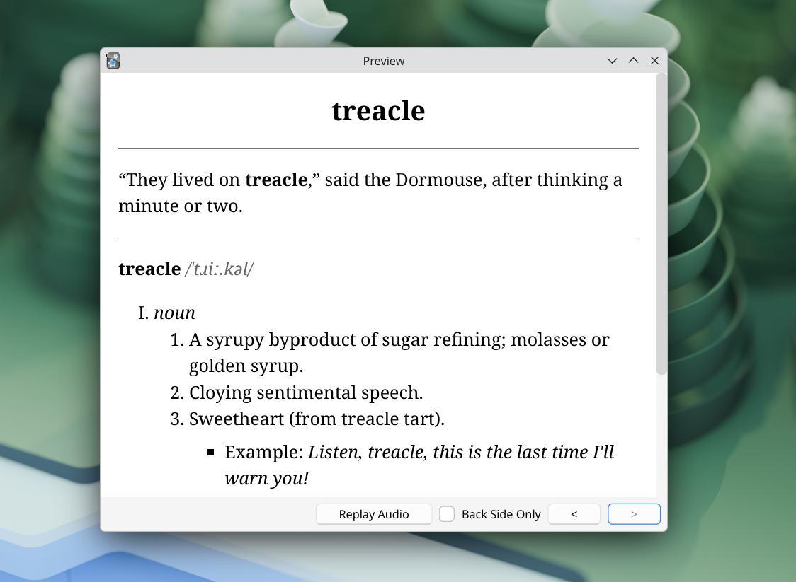

# Kindle2Anki

`k2a.py` turns lookups from a Kindle Vocabulary Builder database (`vocab.db`) into an Anki-importable TSV file.

For now, it only supports English. Definitions are fetched from the [Free Dictionary API](https://dictionaryapi.dev/).

## Screenshot



## Usage

Run:

```console
./k2a.py /path/to/vocab.db
```

At the moment, each run exports cards for one selected book only (not multiple books in a single export).

The exported TSV can be imported into Anki. `k2a.css` contains the default styles for these cards, you can create a dedicated note type in Anki and paste the contents of `k2a.css` into that note type's Styling section.

This project uses only the Python standard library, so no extra dependencies are required.
